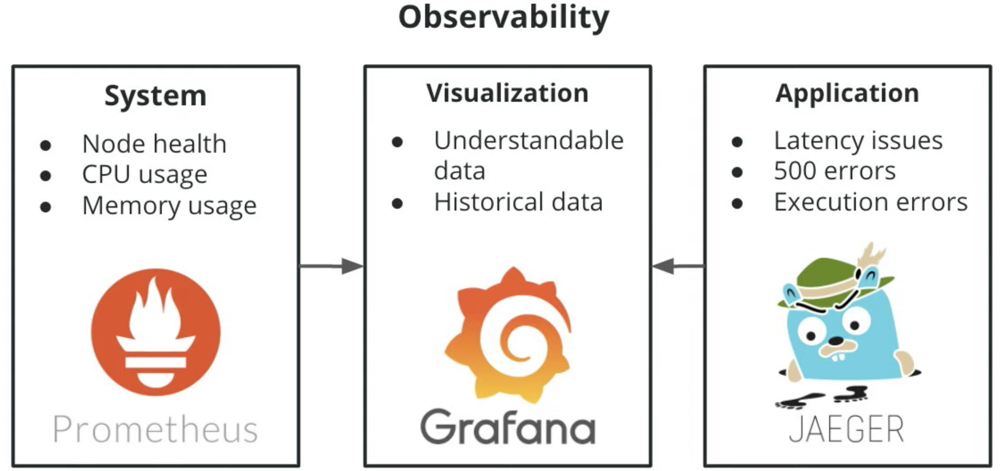

# Lesson Overview

In this lesson, we'll look at the main tools we need for cluster observability. We'll discuss why we need these tools conceptually and then we'll go through the process of installing them.

[](https://www.youtube.com/watch?v=5VqsI33rNx0)

This lesson will get you set up with the tools you need to start doing observability in your cluster.

**Understanding your components.** First, we'll look at the big picture. We'll consider three major needs that we will encounter when trying to do observability: System data, application data, and data visualization. Then we'll discuss why the three tools we're going to use—Prometheus, Jaeger, and Grafana—are great choices for addressing each of these needs.
**Installing Prometheus, Grafana, and Jaeger.** Next, we'll get into the details of how to install Prometheus, Grafana, and Jaeger, and how to confirm that the installations were successful.
**Edge Case: Using ELK.** Although the tools we are using in this course are excellent, industry-standard tools, it's always good to be aware of other options you may run into during your time as an observability expert. So at the end of the lesson, we will briefly consider **ELK** or **Elasticsearch, Logstash, Kibana**, which is a stack that serves as a popular alternative to the one we use in this course.



For example, if you have an application that's using a lot of memory it would be important to identify where it's installed. A tool suited for this purpose (gathering system data) is **Prometheus**, one key reason to use it is because it is perfect for collecting data that is real time in nature. It also has **alerting tools** built in to let us know right away when an error has occurred.

**System data** is critical, but it's not enough by itself, we don't just have a piece of hardware to care about, we also have stuff running out on it. System logs can provide information which may lead to the right direction. **Logs** tell us the **WHAT**, but not the **WHY**. That information in some situations is not too useful for developers and we'll have them running many tests while attempting to figure out what is wrong. It'd be great to get actual information as to what is happening when the application is executing, like `latency issues`, `500 errors` or `execution errors` such as a library not existing. These are issues related specifically to the **application**. **Jaeger** is a good tool for that, it works as a distributed **tracing tool**, it allows to collect data in a distributed system such as what we see in Kubernetes.

Usually we won't have that much time to comb through information and we need to be able to respond quickly, so it's important to have a tool to visualize data. We want to have understandable data, such as a graph which provides us good idea of what's going on and how to address it. You might also want historical data, be able to look at data that's incremental in time and be able to determine trends and patterns in your application's functionality. **Grafana** is a good tool for that.

Putting these 3 tools together as an end product of observability, we can get a Grafana dashboard that shows all the metrics at a glance, showing the status of both system and application
# Big Picture: Understanding Your Components

[](https://www.youtube.com/watch?v=54FSyQYgG_A)

Here are the key points about all three apps, for your reference:

### Prometheus

* Created by **SoundCloud** in 2012
* Belongs to the **Cloud Native Computing Foundation (CNCF)**
* Collects **system** information (contrast this with Jaeger, which collects application information)
* Has a **time-series database** (you can tag with time stamp, making it easier to keep data in chronological order.
* Has its own querying language, called **PromQL**
* Has **built-in alerting tools**
### Jaeger

* Created by **Uber**
* Belongs to **CNCF**
* Collects **application** information (contrast this with Prometheus, which collections system information)
* Provides a **distributed tracing system**
* Uses the **OpenTracing** data model, although it is transitioning to the **OpenTelemetry** model in future
* **Zipkin** is very similar and is a popular alternative

### Grafana

* **Visualization** platform that allows you to build open source **dashboards**
* Supports **time-series databases** as a backend
* It is often bundled with Prometheus
* Expandable with plugins

### Why to use these tools in particular?

They are recognized by the Cloud Native Computing Foundation (CNCF), which is an independent governing body that oversees the [Cloud Native ecosystem](https://landscape.cncf.io/). Rather than having one or two corporations dictate the ecosystem, the larger community can. Because of this, it has become the industry standard. Most of its products are recognized as being the gold standard for cloud computing in their respective spaces. Jaeger and Prometheus are considered graduated projects. They were donated by other companies and have gotten to a state where they can stand on their own. Grafana being a private company is a silver member. This means they are partnered with CNCF and they follow all of their standards and guidelines

### QUESTION 1 OF 2

Below are the three tools we just discussed. Can you can match each of them tools with the most appropriate use case?

PRODUCT | USE CASE
--------|---------
Prometheus | `Time Series Database`
Grafana | `Data Visualization Platform`
Jaeger | `Tracing`

### QUESTION 2 OF 2

Which of the following is a part of **OpenTelemetry**?

- [ ] OpenApplication

- [ ] OpenWatcher

- [ ] OpenNative

- [x] OpenTracing

# Installing Prometheus and Grafana

### Get the starter code

To follow along with the demonstrations and exercises in this course, you'll need some starter files that we've provided in this [GitHub repo](https://github.com/udacity/CNAND_nd064_C4_Observability_Starter_Files).

You'll see that this repo contains two main directories:

* The **Exercise_Starter_Files** directory contains the files you'll need for the exercises (like this one) found throughout the course.
* The **Project_Starter_Files** directory contains the files you'll be using for the project at the end of the course.

- [ ] Clone or download the repo

- [ ] Go to the **Exercise_Starter_Files** directory to find the files you'll need for all of the exercises.

[](https://www.youtube.com/watch?v=CxjoALZdfds)

### Installing Helm

> **Helm** is a popular package manager for Kubernetes. It uses a templating language to make the managing of multiple Kubernetes items in a single application easier to package, install, and update.

Installing Helm is important as this is a common tool used for monitoring and application maintenance. If you get a job as an observability engineer, it is likely you will be asked to install and update applications with Helm. You will also be responsible for patching Prometheus, Grafana and other tools on the cluster so it is good to be familiar with the installation process.

[](https://www.youtube.com/watch?v=XxZCMgOnUrQ)

### QUESTION 1 OF 2

Why do we use Helm 3 instead of Helm 2?

- [ ] Never is always better

- [ ] Helm 3 is much faster and has more packages

- [x] It is more secure since removing the `Tiller` requirement

In a real life situation, we would likely be using some kind of ingress to expose the services to the world. There are a variety of them such as [Istio](https://istio.io/), [Gloo from Solo.io](https://github.com/solo-io/gloo/), [NGINX](https://kubernetes.github.io/ingress-nginx/), [Contour](https://projectcontour.io/) and many others. Different companies and different teams use different solutions.

For the purposes of this course, we will be using `kubectl port-forward`. This is a simple way to forward a Kubernetes service's port to a local port on your machine. This is something you would never do in production but would regularly do in testing.

An example would be if you ran this command:

```
kubectl port-forward service/my-service 7000:80
```

Here you are forwarding the Kubernetes service called my-service and using local port 7000, forwarding it to service port 80.

For this course, you can simply follow our commands—but we encourage you to check out [more details on best practices in the Kubernetes documentation here](https://kubernetes.io/docs/tasks/access-application-cluster/port-forward-access-application-cluster/).


### QUESTION 2 OF 2

When Exposing the service with kubectl and portforwarding, what ports will we use?
(Select all that apply.)

- [ ] 433

- [x] 80

- [x] 3000

- [ ] 2020

[](https://www.youtube.com/watch?v=N6gx6qqSCUA)


### Note:

When installing via the Prometheus Helm chart, the default Grafana credentials are:

```
username: admin 
password: prom-operator
```

whereas the Grafana documentation states (admin:admin).

### Additional Resources

If you would like to learn more about Prometheus and why it is the standard, you can check out [CNCF's website here](https://landscape.cncf.io/selected=prometheus).

# Exercise: Installing Prometheus and Grafana

Alright, now that you've seen the process, it's time to install Prometheus and Grafana for yourself! The steps are listed below.

Please Note for this course, you will be running `kubectl` in the Vagrant VM. If you are familiar with port forwarding and setting up Kubernetes contexts, you can run `kubectl` on your local machine.

**Prerequisites**

* `Vagrant 2.2.XX` and `VirtuaBox 6.1.X` should be installed on your local. Start the VirtualBox.
* Download the Github repository. Navigate to the _CNAND_nd064_C4_Observability_Starter_Files/Exercise_Starter_Files_ directory that contains the Vagrantfile, and run these commands to provision the Vagrant VM:
```
# Run from the directory that contains the Vagrantfile
vagrant up
vagrant ssh
kubectl version
```

### Exercise Instructions

1. First we will need to install Helm v3. You can do it by running the command below.

```
curl https://raw.githubusercontent.com/helm/helm/master/scripts/get-helm-3 | bash
```

2. Next, we want to create the `monitoring` namespace

```
kubectl create namespace monitoring
```

3. Following along with what you saw in the video, install Prometheus and Grafana with Helm. You may have noticed that I installed some CRDs in the video. In version 0.4.2 of the operator, it was needed. As of this update, we are on version 0.7 which no longer needs those CRDs which is why you won't see the command here any longer.

```bash
helm repo add prometheus-community https://prometheus-community.github.io/helm-charts
# helm repo add stable https://kubernetes-charts.storage.googleapis.com # this is deprecated
helm repo add stable https://charts.helm.sh/stable
helm repo update
#helm install prometheus prometheus-community/kube-prometheus-stack --namespace monitoring --kubeconfig /etc/rancher/k3s/k3s.yaml

helm install prometheus prometheus-community/kube-prometheus-stack  --namespace monitoring 
```

### Kubeconfig

By default, kubectl looks for a file named config in the `$HOME/.kube` directory. You can specify other **kubeconfig** files by setting [the KUBECONFIG environment](https://kubernetes.io/docs/concepts/configuration/organize-cluster-access-kubeconfig/) variable or by setting the `--kubeconfig` flag.

For step-by-step instructions on creating and specifying [kubeconfig](https://rancher.com/docs/rke/latest/en/kubeconfig/) files, see Configure [Access to Multiple Clusters](https://kubernetes.io/docs/tasks/access-application-cluster/configure-access-multiple-clusters/).

**NOTE**: By default, `kubectl` checks `~/.kube/config` for a kubeconfig file, but you can use any directory you want using the `--kubeconfig` flag. For example:

`kubectl --kubeconfig /custom/path/kube.config get pods`


4. Verify that it installed

```
kubectl get pods,svc --namespace=monitoring
```

You should see six options.

5. You can port-forward this by running the following command

`kubectl port-forward service/prometheus-grafana --address 0.0.0.0 3000:80 -n monitoring`


6. Access the Grafana using the credentials:

```
username: admin 
password: prom-operator
```


Checklist: Install Prometheus and Grafana with Helm

- [ ] Install Helm3

- [ ] Create the `monitoring` namespace

- [ ] Install Helm Repository for Prometheus

- [ ] Install Prometheus using Helm

- [ ] Use kubectl to port forward, then navigate to 127.0.0.1:3000

- [ ] To log into Grafana use password "prom-operator"


### QUIZ QUESTION

Now let's check if the installation ran correctly. Run kubectl get pods -n monitoring in your terminal. Which one of these most closely matches your results?

(The `xxxxx` is randomly generated, but the rest is mostly static.)

- [x] prometheus-prometheus-node-exporter-xxxxx

- [ ] prometheus-node-reader-xxxxx

- [ ] prometheus-grafana-node-exporter-xxxxx

- [ ] prometheus-prometheus-xxxxx-exporter

# Installing Jaeger

In this next video, Jay will walk through the process of installing Jaeger. Again, we recommend that you just watch the process and then install it for yourself on the following page.

[](https://www.youtube.com/watch?v=h8bXnNnUquM)

While not required, best practices state to install Jaeger in a separate namespace called `observability`. This makes it easier to secure tracing functions from monitoring functions while also giving them separate spaces to operate.

### QUESTION 1 OF 2

What namespace do we want to install Jaeger in?

- [ ] monitoring

- [ ] jaeger

- [x] observability

- [ ] tracing

### QUESTION 2 OF 2

What are the two main purpose of tracing?

(Select **two** correct answers.)

- [x] Follow the flow of data in an application

- [ ] Determine application uptime

- [x] Test latency in the application

- [ ] Provide CPU Metrics

The purpose of tracing is to determine where there may be errors in the application itself. We aren't as concerned about uptime—that's the purpose of monitoring

### Additional Resources

If you would like to learn more about OpenTelemetry and why it is being adopted as a tracing standard, you can [check out their website here.](https://opentelemetry.io/)

# Install Jaeger Operator

### Prerequisites

* The Vagrant VM having Prometheus and Grafana should be up and running. You can use a new terminal tab to open up a new SSH session to your VM.

### Exercise Instructions

In this exercise you will install Jaeger Tracing to your cluster.

We will be using the files hosted in the official [Jaeger GitHub Repo](https://github.com/jaegertracing/jaeger). Run the below code to create the _observability_ namespace and install the Jaeger components:

1. Create a namespace:

`kubectl create namespace observability`

#or

```bash
export namespace=observability
kubectl create namespace ${namespace}
```

2. Installations for the Jaeger Operator:

```bash
# https://knowledge.udacity.com/questions/746251
export jaeger_version=v1.28.0

# jaegertracing.io_jaegers_crd.yaml
kubectl create -f https://raw.githubusercontent.com/jaegertracing/jaeger-operator/${jaeger_version}/deploy/crds/jaegertracing.io_jaegers_crd.yaml

# service_account.yaml
kubectl create -n ${namespace} -f https://raw.githubusercontent.com/jaegertracing/jaeger-operator/${jaeger_version}/deploy/service_account.yaml

# role.yaml
kubectl create -n ${namespace} -f https://raw.githubusercontent.com/jaegertracing/jaeger-operator/${jaeger_version}/deploy/role.yaml

# role_binding.yaml
kubectl create -n ${namespace} -f https://raw.githubusercontent.com/jaegertracing/jaeger-operator/${jaeger_version}/deploy/role_binding.yaml

# operator.yaml
kubectl create -n ${namespace} -f https://raw.githubusercontent.com/jaegertracing/jaeger-operator/${jaeger_version}/deploy/operator.yaml
```

3. Expand the roles to the Cluster. In other words, enable the cluster-wide permissions:

```bash
kubectl create -f https://raw.githubusercontent.com/jaegertracing/jaeger-operator/${jaeger_version}/deploy/cluster_role.yaml

kubectl create -f https://raw.githubusercontent.com/jaegertracing/jaeger-operator/${jaeger_version}/deploy/cluster_role_binding.yaml
```


4. Verify:

```bash
kubectl get deployments jaeger-operator -n observability
kubectl get pods,svc -n observability
# OPTIONAL - Deploy a sample application
# Note that the command below is an updated one.
kubectl apply -f https://raw.githubusercontent.com/jaegertracing/jaeger-operator/master/examples/business-application-injected-sidecar.yaml
```


### Reference

[Getting started with jaeger-operator](https://github.com/jaegertracing/jaeger-operator#getting-started)

### Checklist: Install Jaeger

- [ ] Create the `observability` namespace
- [ ] Install Jaeger using the files listed above

### QUIZ QUESTION

Run `kubectl get pods -n observability` in your terminal. Which one of these most closely matches your results?

- [x] jaeger-operator
- [ ] jaeger-tracer
- [ ] jaeger-deployment
- [ ] jaegertrace-operator

# Using ELK

[](https://www.youtube.com/watch?v=5tiZnObO-bk)

* **ElasticSearch** is an open source NoSQL database used for indexing data and creating custom search engines.
* **Logstash** is an open source log collector and transformer. It is used to collect logs from various sources to be ingested and stored in ElasticSearch.
* **Kibana** is the open source dashboard and graphs tool. Similar to Grafana, it makes it easier to design visualizations of data.

This is great for people who:

* Already use ElasticSearch
* Need SQL-like language
* Need a search engine
* No time-series data requirement
* Have other alerting tools

### QUESTION 1 OF 2

Elk is ElasticSearch plus what two components?

- [ ] Logstash and Kanban

- [ ] Logger and Kibana

- [ ] Logger and Kanban

- [x] Logstash and Kibana

### QUESTION 2 OF 2

Which of these scenarios would be good reasons to use an ELK stack vs a Prometheus/Grafana stack?

(Select all that apply.)

- [ ] ELK is more cost efficient than Prometheus/Grafana.

- [x] ElasticSearch is currently used in your environment.

- [ ] Developers are moving towards ELK and Prometheus is seen as a deprecated tool.

- [x] There is a use case for SQL like language.

- [ ] ELK has a better record for storing durable data.

# Lesson Review


## Lesson Outline

This lesson will get you set up with the tools you need to start doing observability in your cluster.

* **Understanding your components**. First, we looked at the big picture. We considered three major needs that we will encounter when trying to do observability: System data, application data, and data visualization. Then we discussed why the three tools we're using—Prometheus, Jaeger, and Grafana—are great choices for addressing each of these needs.
* **Installing Prometheus, Grafana, and Jaeger**. Next, we got into the details of how to install Prometheus, Grafana, and Jaeger, and how to confirm that the installations were successful.
* **Edge Case: Using ELK**. Although the tools we are using in this course are excellent, industry-standard tools, it's always good to be aware of other options you may run into during your time as an observability expert. So at the end of the lesson, we briefly considered `ELK` or `Elasticsearch`, `Logstash`, `Kibana`, which is a stack that serves as a popular alternative to the one we use in this course.


