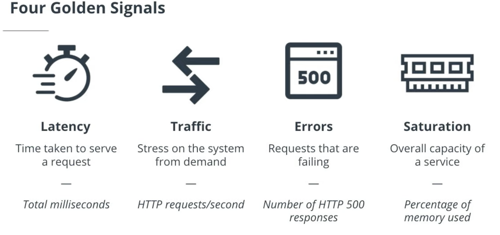
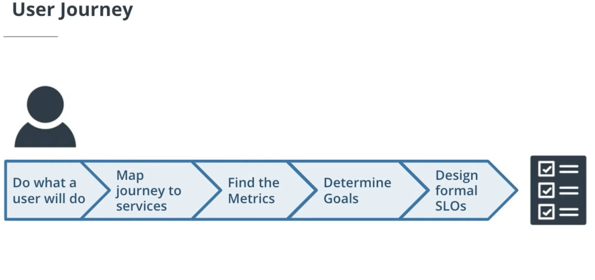

# SLIs, SLOs, and Error Budgets

## Lesson Outline

This lesson is all about **reliability metrics**. In order to observe performance, we first need to get clear on how we are defining and measuring it, and that's what we'll cover here.

* **Defining performance**. The first thing we need to do is define what we mean by site reliability or performance. We will talk about performance in terms of providing a certain level of service, and we'll go over what are called the four golden signals that are used in site reliability modeling.
* **Service-Level Objectives (SLOs)**. We also need a clear objective or goal, and this is where Service-Level Objectives (or SLOs) come in. We will talk about what SLOs are and what factors to consider when setting them.
* **Service-level indicators (SLIs)**. Once we have a clear definition and objective for the level of performance we want to deliver, we need to consider how we will actually measure this performance. This is done using Service-Level Indicators or SLIs.
* **Error Budgets**. Since we cannot guarantee 100% performance, we need to plan for errors. For example, if we are OK with 99% reliability on a metric, that means we have an error budget of 1%. We are deciding that if things get any worse than that 1%, this is a signal to us that an improvement is needed.
* **Building SLAs**. Finally, we will bring this all together and examine Service-Level Agreements or SLAs. While you personally won’t have to worry about SLAs as an SRE, it is important to understand the context of SLAs as it does play a part in the overall SRE model.

### How to ensure that the deployed applications are functioning reliably?

This question led to the creation of the site reliability engineer. They were more performance focused. Performance focused meant they were customer centric, because we want our customers to have a good experience. This model was originally started by Google, but it's now adopted by organizations the world over. Every company does SRE a little differently, but there are a few concepts that remain the same across the organization.

We need to know what it is that we are trying to measure and what sire reliability means.

# Measuring Performance (How Should we define its)

Remember, the main value that we as site reliability engineers add, that is not provided by other roles like sysadmins and DevOps engineers, is that we ensure that a deployed application has a good level of performance for the customer. We call this the service level.

> The **service level** is the degree (i.e. level) of performance that an application (or service) provides to the user.

Typically, service is defined in terms of four core properties, called the **Four Golden Signals**:

* **Latency** — The time taken to serve a request (usually measured in ms).
* **Traffic** — The amount of stress on a system from demand (such as the number of HTTP requests/second).
* **Errors** — The number of requests that are failing (such as number of HTTP 500 responses).
* **Saturation** — The overall capacity of a service (such as the percentage of memory or CPU used).

These signals are generally considered the pillars of SRE best practices because most issues will fall into one of these four categories. By defining performance in these terms, it’s easier to plan, identify, and execute when we are building our goals for our service level.

### QUESTION 1 OF 2

Below are the three roles we just discussed. Can you match each with the area they focus on most?

FOCUS | ROLE
------|-------
Performance-focused and customer-centric | `Site Reliability`
Focused more on infrastructure as code | `DevOps`
Provisioning hardware and managing infrastructure | `SysAdmin`

### QUESTION 2 OF 2

Below are the Four Golden Signals. Can you match each of them with an example of how we would measure that signal?

WHAT WE MEASURE | GOLDEN SIGNAL
----------------|------------------
Number of milliseconds taken to serve a request | `Latency`
Percentage of CPU used. | `Saturation`
Number of HTTP requests/second. | `Traffic`
Number of HTTP 500 responses. | `Errors`

### Additional Resources

If you would like to learn more about Service Level Objects, check out this [chapter on SLOs in the Google Site Reliability Engineering book](https://landing.google.com/sre/sre-book/chapters/service-level-objectives/).

# Learning about SLOs

## What is an SLO?

Now that we are clear about the Four Golden Signals, we are ready to set some specific objectives. These are called our Service-Level Objectives.

> A **Service-Level Objective** (SLO) is a measurable goal set by the SRE team to ensure a standard level of performance during a specified period of time.

For example, we might specify an SLO like "99.99% uptime per month". Typically SLOs are measured in terms of latency and uptime, although it is not unusual for SRE teams to add additional goals like _database speed_ and _disk availability_.

## User Journey

When creating an SLO, it is important to be customer-centric. If we keep user experience and expectations at the center of our planning, we will have a strong SLO strategy. A common way to make sure you are customer-centered in your strategy is to map out a **user journey** for the application.

Here is a process you can follow to help ensure your SLOs are customer-centric:

* **Do what a user would do**. You will want to stress test the product and use it the same way the user would.
* **Map the journey to services**. Once you understand the customer journey, you can map out what that journey looks like in terms of what specific services are used. e.g.: When I click the "checkout" button, what services are hit to complete that action?
* **Find the metrics**. Once you know what services are involved, you can identify the metrics for those services.
* **Determine goals**. Once we have relevant metrics in mind, it is relatively easy to determine what goals would be reasonable and would tap into these metrics. e.g.: uptime of 99.9% over a month etc.
* **Design formal SLOs**. Once you have your goals, it's time to formalize them as SLOs. These SLOs will then appear in your `team charter`, and you and your team will have a clear objective that you can be accountable for.

Basing your SLOs on a user journey is very important because, at the end of the day, the person who ultimately cares about performance is the user

Choose just enough SLOs to provide good coverage of your system’s attributes. Defend the SLOs you pick: if you can’t ever win a conversation about priorities by quoting a particular SLO, it’s probably not worth having that SLO.

### Perfection can wait

You can always refine SLO definitions and targets over time as you learn about a system’s behavior. It’s better to start with a loose target that you tighten than to choose an overly strict target that has to be relaxed when you discover it’s unattainable.

SLOs can—and should—be a major driver in prioritizing work for SREs and product developers, because they reflect what users care about. A good SLO is a helpful, legitimate forcing function for a development team. But a poorly thought-out SLO can result in wasted work if a team uses heroic efforts to meet an overly aggressive SLO, or a bad product if the SLO is too lax. SLOs are a massive lever: use them wisely.

### QUESTION 1 OF 3
A key aspect of an SLO is that they involve measurable objectives. Below are some different metrics we can use when creating SLOs. Can you match each metric with the correct description?

SLO | DESCRIPTION
----|--------------
Response time of requests | `Latency`
The amount of failures in a unit of time | `Failure Rate`
Average bandwidth | `Network Capacity`
Time a service is active | `Uptime`

### QUESTION 2 OF 3
Which of the following are examples of SLOs?

- [x] 99.5% of requests return in 50ms in the past month.

- [ ] We will use the most up to date version of Linux within 6 months. 

- [ ] We will always have 5 engineers on staff every quarter

- [ ] We only use a specific cloud provider 

- [x] 99.99% of response codes are 200s or 300s per month

### QUESTION 3 OF 3

Your company is working on modernizing their applications. This decision was triggered by a report that customers feel the application is "too slow". Thus, measuring speed and performance is of great importance.

Use the matching quiz to order the steps you would need to take to help your customers.

STEP ORDER | STEP ACTION
-----------|----------------
First | `Document User Journey by Business Impact`
Second | `Identify Services Involved in Journey`
Third | `Determine Metrics to use to measure customer experience.`
Fourth | `Determine Goals`

### Additional Resources

If you would like to learn more about Service Level Objectives, check out [this chapter on SLOs in the Google Site Reliability Engineering book](https://landing.google.com/sre/sre-book/chapters/service-level-objectives/).

# Exercise: SLOs

During your everyday work as an SRE—you'll need to work with SLOs. So let's get a little practice.

## Part 1: Non-Technical SLOs

It may help to think about SLOs that apply to everyday, non-technical situations. While you may be new to the term "SLO", I guarantee that you have experienced SLOs in real life—albeit under different names (such as "customer satisfaction").

Suppose that you are working on **improving the customer service at a grocery store**. 

Keep in mind that your SLOs should:

* Be related to the customer service objective
* Be measurable
* Be something you can control
* Specify a certain level of service (e.g., 99%)
* Specify a period of time (e.g., per day, per month, etc.)

Here are some things that we could measure:

* *Wait time in line*
* *Item availability*
* *Credit card terminal uptime*
* *Bagger availability*
* *Refresh rate of bread in bakery*

Remember, we want to measure things that are **within our control**. Something like *weather in the grocery store parking lot*, for instance, would not be good for an SLO, since it is out of our control.

So those are some things we could measure, but an SLO isn't just a metric—an SLO also includes **a specific target service level** and **a period of time**.

For example, if we took *wait time* or *bagger availability*, the SLOs might be something like:

* **99% of customers will wait in line at the checkout counter for less than 5 minutes per month.**
* **All open checkout lanes will have 1 or more bagger 95% of the time per day.**

Compare your answers with these two. Do they include all the key components of an SLO?

[Real-World SLO Examples Video](https://video.udacity-data.com/topher/2020/October/5f91f633_nd064-c4-l2-a04-exercises-slos/nd064-c4-l2-a04-exercises-slos_720p.mp4)

## Part 2: Technical/Site Reliability SLOs

Some of the core metrics/signals we use as observability experts based on core metrics or signals (such as the Four Golden Signals) are:

* Latency
* Error rate
* Network capacity
* Traffic
* Uptime
* Saturation

So if we take these metrics and use them to create SLOs, we would have things like:

* **99% of all HTTP statuses will be 20x in a given month (Uptime)**
* **99% of all requests will take less than 20ms in a given month (Latency)**

Hopefully this gives you some confidence in your ability to write SLOs. In the end, this is a pretty straightforward process, as long as you remember that your SLOs should:

1. Target something measurable
2. Target something under your control
3. Relate to the customer service objective
4. Give a specific service level you want to achieve
5. Specify a period of time

# Service-Level Indicators (SLIs)

How do we know when we’ve reached that goal? This is where *Service-Level Indicators* come in.

> A **Service-Level Indicator (SLI)** is a specific metric used to measure the performance of a service.

Sometimes the term SLI is used to refer to the general metric—such as _uptime_ or _latency_. But really what we need in the end is an actual _measurement_. For example, suppose that your team has the following SLO:

> The application will have an uptime of 99.9% during the next year.

In this case, your SLI would be the actual measurement of the uptime. Perhaps during that year, you actually achieved 99.5% _uptime_ or 97.3% uptime. These measurements are your SLIs—they indicate the level of performance your service actually exhibited, and show you whether you achieved your SLO (in this case, the SLIs show that performance fell short of your objective).

Notice that the above example is a **ratio**. Specifically, it is a ratio of a **measurement** to a given amount of **time** (the measured uptime per year). When you think of SLIs, think in terms of ratios like this—a ratio of X / Y, where X is usually a measurement and Y is usually an amount of time.

Choosing too many indicators makes it hard to pay the right level of attention to the indicators that matter, while choosing too few may leave significant behaviors of your system unexamined. A handful of representative indicators are enough to evaluate and reason about a system’s health.

Services tend to fall into a few broad categories in terms of the SLIs they find relevant:

* **User-facing serving systems**, such as frontends, generally care about `availability`, `latency`, and `throughput`. In other words: Could we respond to the request? How long did it take to respond? How many requests could be handled?
* **Storage systems** often emphasize `latency`, `availability`, and `durability`. In other words: How long does it take to read or write data? Can we access the data on demand? Is the data still there when we need it? 
* **Big data systems**, such as data _processing pipelines_, tend to care about `throughput` and `end-to-end latency`. In other words: How much data is being processed? How long does it take the data to progress from ingestion to completion? (Some pipelines may also have targets for latency on individual processing stages.)
* All systems should care about `correctness`: was the right answer returned, the right data retrieved, the right analysis done? `Correctness` is important to track as an indicator of system health, even though it’s often a property of the data in the system rather than the infrastructure per se, and so usually not an SRE responsibility to meet.

### An SLI Needs to...

* Be _intentional_. e.g.: "measure CPU saturation"
* Be _relevant_. Match with the stated SLO. e.g.: "How many error messages are we seeing?"
* Focus on the _Four Golden Signals_
* Be _measurable_.e.g.: "The amount of milliseconds it takes for a request to complete"
* Have _direct impact_

### QUIZ QUESTION

The terminology surrounding SLOs, SLIs, and signals can get a little confusing.I t can be a little tricky to see the distinction between them. Below are some examples. Can you identify which is which?

**EXAMPLE** | **SLO, SLI, OR SIGNAL**
------------|---------------------------
The average time taken to return a request will be less than 200 ms, during the month of May. | `SLO`
The average time taken to return a request during the month of May was 194 ms. | `SLI`
Latency | `General Type of Metric Used`

### Additional Resources

If you would like to learn more about the distinction between SLOs and SLIs, you may want to check out:

* [This blog post from Elisa Binette on best practices for setting SLOs and SLIs](https://blog.newrelic.com/engineering/best-practices-for-setting-slos-and-slis-for-modern-complex-systems/)
* [This blog post from Google Cloud Platform on SLIs, SLOs, and SLAs](https://cloud.google.com/blog/products/gcp/sre-fundamentals-slis-slas-and-slos)

# Exercise: SLIs

### Reflect on SLIs

Suppose that you are monitoring the performance of services at a fast food restaurant. See if you can describe 3–5 SLIs that you could use to measure performance.

* Number of orders/hour
* Number of 5-star ratings/day
* Number of returned orders/week
* Hamburgers sold/month

### What Happens When You Miss SLIs?

* **Triage:** Check what is happening and try to get the system back up and running
* **Mitigate:** Determine the best course of action
 - **Rollback:** Is it going to take some time to fix the issue? Then rollback to last known working version.
 - **Patch:** Sometimes somebody knows exactly what they did wrong and they can fix it relatively quickly.
* **Postmortem:** Learn from what happened. Take a look at everything that happened, when the issue was first reported. what indicators we saw? Did we see any error message? What steps were taken to diagnose the issue? Gather all information useful to determine the root cause and prevent anything like this to happen again.
* **Act:** Have a team meeting and decide how you want to change things. 

### QUESTION 2 OF 2

Suppose you have the following SLO:

> HTTP requests will take 10ms or less to complete (on average) each month.

When you look at your SLI, you are finding that in actuality it takes around 20ms. Your team was able to address the issue with a rollback. What next step should be taken?

- [ ] Perform a postmortem to identify the root cause
- [ ] Adjust the error budget to a more reasonable rate.
- [ ] Change the SLO and SLI policy of your organization. 
- [ ] Improve your CI/CD pipeline to more adequately test your code prior to release. 

# Error Budgets

No matter how hard we try, inevitably there will be some downtime. For that reason, we give ourselves a buffer or _error budget_.

> An **error budget** is a buffer in an SLO that allows for a small amount of error.

Error budgets can be visualized with this formula:

> Error budget = 100% – SLO

For example, when we state an SLO like:

> The application will have 99.9% uptime each month.

We are giving ourselves a buffer of 0.1% of the month to experience downtime—meaning that experiencing a small—perhaps unavoidable—amount of downtime will not indicate we failed to meet the objective.

It’s both unrealistic and undesirable to insist that SLOs will be met 100% of the time: doing so can reduce the rate of innovation and deployment, require expensive, overly conservative solutions, or both. Instead, it is better to allow an error budget—a rate at which the SLOs can be missed—and track that on a daily or weekly basis. Upper management will probably want a monthly or quarterly assessment, too.

### Maintenance Windows

We want our error budget to have a purpose, learn from our mistakes, but we also want to try to reduce hitting that error budget as much as possible. One way to avoid hitting an error budget is to use maintenance windows. One of the biggest ways people see downtime is when they're trying to make changes to the system, so you will set **dedicated times for maintenance**. Usually this will be at a **low traffic time**. So if you see that nobody is really using your website from, let's say, midnight to 3AM, that'd be a great time to have maintenance window.

You'll also want to **direct traffic to a separate environment**. Best practice is to have at least two environments, maybe more for high availability and that way when you are working on the changes on environment 1, you just redirect all the users to a clone of that environment.

### No-Blame Policy

* Don't blame people and focus on fixing issues as a team. 
* Create a safe environment by focusing on fixing errors rather than pointing fingers.

### When to Disconsider an Error Budget?

* **Who owns the problem?** Many teams are spread out. You might have multiple teams in your organization for different projects. Maybe somebody already acknowledged that is already working on it.
* **Is it withing your power of scope?** 
* **Was testing occurring?** Did you error budget lapse during a penetration or load test?
* **Categorization**: e.g.: maybe the service is a beta version that shouldn't be measured or monitored at all. So disconsider it.

### QUESTION 1 OF 2

If we have an SLO that states that we will have an uptime of 99.95%, what is our error budget?

- [x] 0.05%
- [ ] 0.5%
- [ ] 1%
- [ ] 0.1%

### QUESTION 2 OF 2

Suppose you find that you are **exceeding your error budget**. Below are some events that might cause this to happen. For some of them, you should take immediate action or re-evaluate your SRE strategy. For others, you should not take any action.

For which of these should you take action or re-evaluate your strategy?

(Select two correct answers.)

- [ ] Company wide network outage
- [ ] Another team was responsible for the outage and they are working on it
- [x] A postmortem reveals an excessively restrictive policy
- [ ] The error budget consumption was out of scope (e.g., someone was performing a load test)
- [x] A bug in the code

#### Correct!

You will always want to do a postmortem to figure out what happened. Sometimes you will find instances where an SLO is too restrictive and you may need to re-evaluate your strategy.

And of course, if there is a bug in the code, you should address it, since the service itself shouldn't be causing failures.

# Exercise: Error Budgets

### QUESTION 1 OF 2

Suppose we set the following SLO:

> The application will be available 97% of the time during each month.

This past month, you received 10,500,000 HTTP requests. How many requests can be HTTP 500 responses?

- [ ] 300,000
- [ ] 10,000,000
- [x] 315,000
- [ ] 150,000
- [ ] 10,185,000

### QUESTION 2 OF 2

Your error budget is 25 minutes of downtime per month. This past month you had 45 minutes of downtime. It was determined that the issue was related to your database caching maxing out its disk space every other week. You are asked to make some recommendations on how we can address this in the future. Which are the best ideas?

(Select all that apply.)

- [ ] Tell engineering to rewrite the code

- [x] Determine what occurs every other week

- [ ] Expand the disk size of the cache

- [x] Find what services are using the cache

# Service-Level Agreements (SLAs)

Generally speaking, SLAs are more of a concern for the customers, business development teams, and legal departments than the SRE team.

Although you as an SRE typically won't have to work directly with Service-Level Agreements on a daily basis, it's still good to have an awareness of them.

> **Service-Level Agreements (SLAs)** are legally binding contracts that guarantee a service level to the customer

If the SLA is not met, typically the company will provide some form of compensation to the customer.

### QUIZ QUESTION

Which one of these would typically be out of scope for an SLA for a Platform as a Service company?

- [ ] The uptime of your managed databases.
- [ ] The uptime of your servers. 
- [ ] The software services that automates the deployment of customer software.
- [x] The service that your customer deploys.

# Lesson Review

## Lesson Outline

This lesson was all about reliability metrics. In order to observe performance, we first needed to get clear on how we are defining and measuring it, and that's what we covered in this lesson.

* **Defining performance.** The first thing we needed to do was define what we mean by site reliability or performance. We talked about performance in terms of providing a certain level of service, and we went over what are called the four golden signals that are used in site reliability modeling.
* **Service-Level Objectives (SLOs).** We also needed a clear objective or goal, and this is where Service-Level Objectives (or SLOs) come in. We talked about what Service Level Objectives are and what factors to consider when setting them.
* **Service-level indicators (SLIs).** Once we have a clear definition and objective for the level of performance we want to deliver, we need to consider how we will actually measure this performance. This is done using service-level indicators or SLIs.
* **Error Budgets.** Since we cannot guarantee 100% performance, we need to plan for errors. For example, if we are OK with 99% reliability on a metric, that means we have an error budget of 1%. We are deciding that if things get any worse than that 1%, this is a signal to us that an improvement is needed.
* **Building SLAs.** Finally, we brought this all together and examined Service-Level Agreements (SLAs). While you personally won’t have to worry about SLAs in your role as an observability engineer, it is important to understand the context of SLAs as it does play a part in the overall SRE model.

